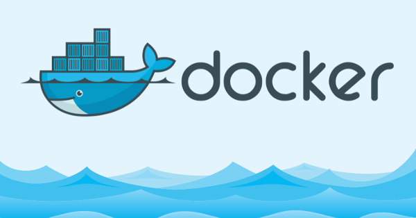

Docker je nástroj, který umožňuje snadno tvořit, nasazovat a spoustět aplikace za použití kontejnerů. Kontejner pootm umožňuje vývojáři distribuovat aplikaci se vším, co ke svému běhu potřebuje jako jeden balík dat. Támto způsobem lze celkem snadno zajistit, že aplikace napsaná ve specifickém prostředí bude přenositelná na další stroje.

Z určitého pohledu se můžeme na Docker dívat jako na virtualizační stroj, který však nevytváří další operační systém, ale používá linuxové jádro stroje, na kterém běží. Tato filosofie s sebou nese malé režijní náklady na prostředky cílového počítače.

Důležité je říct, že Docker je open source a má kolem sebe velmi aktivní komunitu vývojářů a každý může přišpět.

## Pro koho je Docker

Docekr přináší užitek několika skupinám uživatelé, ať už to jsou vývojáři, systémový administrátoři a celá komunita DevOps. Pro vývojáře Docker znamená prostředek, který je odprostí od obav z problémů, které dřív vznikali díky vzájemné nekompatibilitě dvou různých systémů. Zároveň mají uživatelé k dispozici velké množství již napsaných kontejnerů, které jsou ihned použitelné.